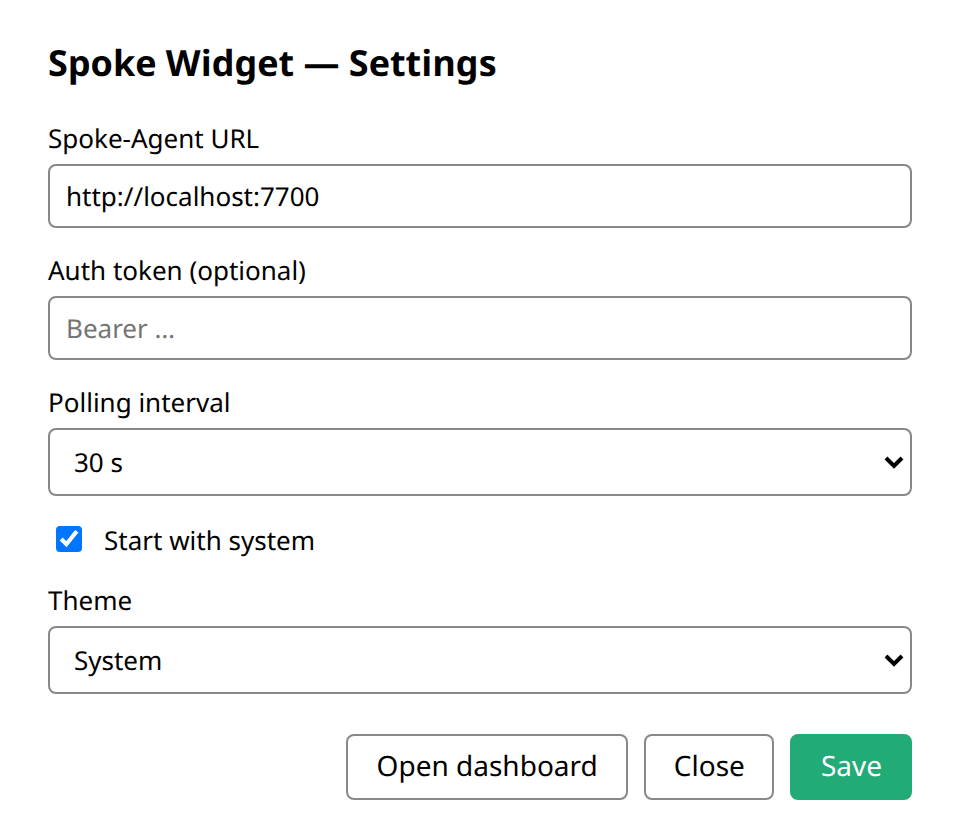
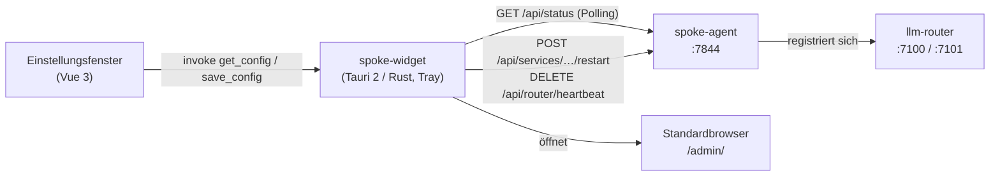

# spoke-widget

[](https://github.com/janpow77/spoke-widget/actions/workflows/build.yml)
[](https://github.com/janpow77/spoke-widget/actions/workflows/release.yml)
[](LICENSE)

**Plattformübergreifendes Tray-Widget (Tauri 2, Rust + WebView) für den [spoke-agent](https://github.com/janpow77/spoke-agent). Ein Tray-Symbol zeigt per Ampelfarbe den Zustand des lokalen [Spoke-Stacks](https://github.com/janpow77/spoke-stack) und öffnet mit einem Klick das Dashboard.**

Das Widget ist bewusst schlank: Die eigentliche Verwaltungsoberfläche bleibt im spoke-agent (`http://localhost:7844/admin/`). Läuft unter Linux, Windows und macOS.

## Auf einen Blick

- **Status ohne Fenster:** Das Tray-Symbol wechselt die Farbe je nach Router-Verbindung und Dienstzustand.
- **Ein Klick zum Dashboard:** Linksklick öffnet `<agent>/admin/` im Standardbrowser.
- **Schnellaktionen im Menü:** Spoke-Stack neu starten, Heartbeat pausieren.
- **Kleines Einstellungsfenster (Vue 3):** Agent-URL, optionales Bearer-Token, Abfrageintervall, Autostart, Theme.
- **Autostart** über `tauri-plugin-autostart` (LaunchAgent unter macOS, Registry-`Run` unter Windows, `.desktop`-Autostart unter Linux).

<picture>
  <source media="(prefers-color-scheme: dark)" srcset="docs/assets/settings-dark.png">
  
</picture>

## Architektur



Das Widget fragt `GET /api/status` alle 10, 30 oder 60 Sekunden ab (Zeitlimit 2 s). `router.connected` und das Feld `status` je Dienst bestimmen die Farbe:

| Farbe | Zustand | Bedeutung |
| --- | --- | --- |
| grün | Connected | Router verbunden, alle gefundenen Dienste `ok` |
| gelb | Degraded | Router verbunden, mindestens ein Dienst nicht `ok` |
| rot | Disconnected | Router nicht verbunden |
| grau | Agent unreachable | spoke-agent nicht erreichbar (Netzfehler, abgewiesen, Zeitüberschreitung) |
| `?` | Unknown | Startzustand, noch keine Abfrage abgeschlossen |

## Schnellstart

Fertige Pakete liegen unter [Releases](https://github.com/janpow77/spoke-widget/releases) (erzeugt vom Workflow `release.yml` bei Tags `v*`). Voraussetzung ist ein laufender spoke-agent unter `http://localhost:7844`.

```bash
# Linux (Debian/Ubuntu)
sudo apt install ./spoke-widget_0.1.0_amd64.deb

# oder portabel als AppImage
chmod +x spoke-widget_0.1.0_amd64.AppImage
./spoke-widget_0.1.0_amd64.AppImage

# Erreichbarkeit des Agents prüfen
curl http://localhost:7844/api/status
```

Unter GNOME ist für das Tray-Symbol ggf. die Erweiterung [AppIndicator and KStatusNotifierItem Support](https://extensions.gnome.org/extension/615/appindicator-support/) nötig.

<details>
<summary><b>Windows und macOS</b></summary>

**Windows:** `spoke-widget_0.1.0_x64-setup.exe` oder die `.msi` installieren. Der Installer ist in 0.x **nicht signiert**; SmartScreen warnt, dann „Weitere Informationen“ → „Trotzdem ausführen“. Ein signierter Build ist für v1.0 geplant.

**macOS:** `spoke-widget_0.1.0_aarch64.dmg` (oder `_x86_64`) einhängen und die App nach `/Applications` ziehen. Der Build ist **weder signiert noch notarisiert**, daher vor dem ersten Start:

```bash
xattr -dr com.apple.quarantine /Applications/Spoke\ Widget.app
```

</details>

<details>
<summary><b>Tray-Menü</b></summary>

| Eintrag | Wirkung |
| --- | --- |
| Open Dashboard | Standardaktion (auch Linksklick). Öffnet `<agent>/admin/` im Systembrowser. |
| Status: \<Text\> | Nur Anzeige, zeigt das Ergebnis der letzten Abfrage. |
| Restart Spoke-Stack | `POST <agent>/api/services/all/restart`; bei 404 Rückfall auf Neustart je Dienst. |
| Pause Heartbeat | `DELETE <agent>/api/router/heartbeat` (Umschalter). |
| Settings… | Öffnet das Einstellungsfenster. |
| About… | Öffnet dieses Repository auf GitHub. |
| Quit | Beendet das Widget. |

</details>

<details>
<summary><b>Konfiguration</b></summary>

Gespeichert als JSON unter

- Linux: `~/.config/spoke-widget/config.json`
- Windows: `%APPDATA%\spoke-widget\config.json`
- macOS: `~/Library/Application Support/spoke-widget/config.json`

| Feld | Standard | Beschreibung |
| --- | --- | --- |
| `agent_url` | `http://localhost:7844` | Basis-URL des spoke-agent |
| `auth_token` | _(leer)_ | Optionales Bearer-Token (entspricht `SPOKE_AGENT_AUTH_TOKEN` des Agents) |
| `poll_interval_s` | `30` | 10 / 30 / 60 |
| `autostart` | `true` | Start bei der Benutzeranmeldung |
| `theme` | `system` | `light` / `dark` / `system` |

</details>

<details>
<summary><b>Aus dem Quellcode bauen</b></summary>

Voraussetzungen:

- Rust **1.77+** (Mindestversion für Tauri 2)
- Node **18+** (für die Vue-Einstellungsoberfläche)
- Plattformabhängige Build-Abhängigkeiten laut [Tauri-Voraussetzungen](https://v2.tauri.app/start/prerequisites/)

```bash
git clone https://github.com/janpow77/spoke-widget
cd spoke-widget

# UI-Abhängigkeiten installieren
npm --prefix ui install

# Entwicklung mit Hot-Reload – aus dem Repo-Wurzelverzeichnis starten,
# damit der beforeDevCommand `npm --prefix ui run dev` aufgelöst wird.
cargo install tauri-cli --version "^2.0" --locked
cargo tauri dev

# Release-Bundle – ebenfalls aus dem Wurzelverzeichnis, nicht aus src-tauri/
cargo tauri build
```

Die Pakete liegen danach unter `src-tauri/target/release/bundle/`.

**Symbole neu erzeugen:** Tray- und App-Symbole entstehen mit `scripts/gen_icons.py` (Python 3 + Pillow). Nach Farbänderungen erneut ausführen:

```bash
python3 scripts/gen_icons.py
```

</details>

<details>
<summary><b>Tests</b></summary>

```bash
cd src-tauri
cargo fmt --all -- --check
cargo clippy --all-targets -- -D warnings
cargo test --all
```

Die Unit-Tests decken ab:

- den `SpokeState`-Klassifizierer (Kombinationen aus Router-Status und Dienstzuständen),
- die HTTP-Schicht von `status_poller` (gegen `mockito`),
- den Rückfall von `restart_all` auf Neustarts je Dienst bei 404,
- die Weitergabe des Bearer-Tokens,
- den `MockOpener` (Stellvertreter für den produktiven Opener aus `tauri-plugin-shell`).

Dieselben drei Befehle laufen in der CI ([build.yml](.github/workflows/build.yml)), dazu ein Bundle-Build für Linux, Windows und macOS.

</details>

<details>
<summary><b>Fehlerbehebung</b></summary>

- **Tray zeigt „Agent unreachable“:** Prüfen, ob der spoke-agent unter der eingestellten URL lauscht (`curl http://localhost:7844/api/status`). Verlangt der Agent ein Token, dieses in den Einstellungen eintragen.
- **Tray-Symbol erscheint unter GNOME nicht:** AppIndicator-Erweiterung installieren (siehe Schnellstart).
- **„Restart Spoke-Stack“ scheitert mit 404:** Das Widget fällt auf `/api/services/{name}/restart` je Dienst zurück. Liefert auch das 404, ist der spoke-agent älter, als das Widget erwartet.
- **Heartbeat-Umschalter meldet Fehler:** Der Endpunkt `DELETE /api/router/heartbeat` steht auf der Roadmap des spoke-agent, ist aber nicht in jeder Version enthalten; das Widget meldet dann einen eindeutigen Fehler.

</details>

<details>
<summary><b>Roadmap</b></summary>

- v0.2: signierte Builds (macOS-Notarisierung, Windows-Codesignatur) und eingebauter Updater (`tauri-plugin-updater`).
- v0.3: ausführlicheres Untermenü je Dienst (Log-Ende, einzelner Neustart).
- v0.4: Tray-Badge mit belegtem GPU-Speicher (aus `discovery.gpu`).

</details>

## Verwandte Projekte

- [spoke-agent](https://github.com/janpow77/spoke-agent) – Dienst, den das Widget abfragt und steuert
- [spoke-stack](https://github.com/janpow77/spoke-stack) – der lokale Stack, dessen Zustand angezeigt wird

## Lizenz

[MIT](LICENSE) © 2026 Jan Riener
